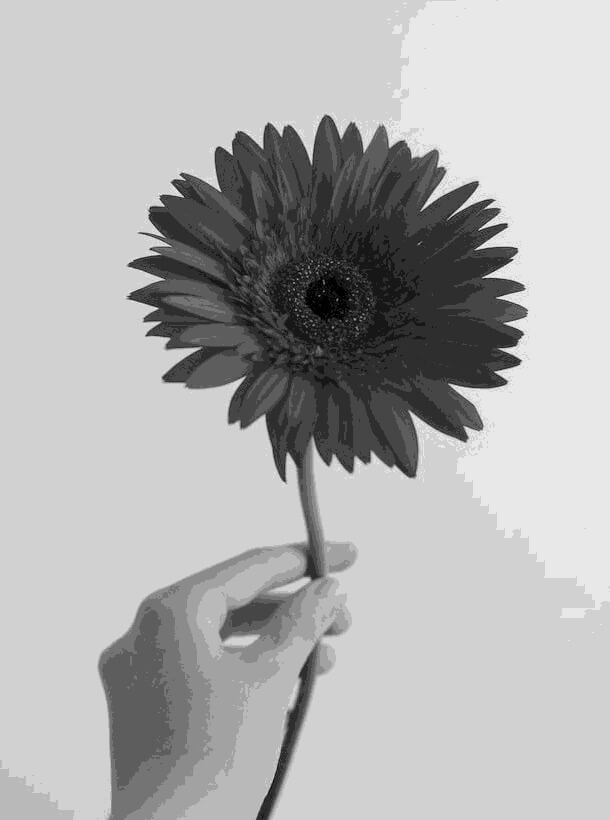

# Image Processing Toolkit

A collection of Python utilities for image processing and ASCII art generation.

## Overview

This toolkit contains two main utilities:
- **Image Converter**: Batch converts images to grayscale JPG format
- **ASCII Art Generator**: Transforms images into ASCII art with customizable parameters

Example
Here's an example of the ASCII art transformation:
<table>
  <tr>
    <td><b>Original Image</b></td>
    <td><b>ASCII Art Output</b></td>
  </tr>
  <tr>
    <td>
      
    </td>
    <td>
      <pre>
>>>>>>>>>>>>>>>>>>>>>>>>>>>>>>>>>>>>>>>>>>>>>i>iI:::::::::::::::::::::
>>>>>>>>>>>>>>>>>>>>>>>>>>>>>>>>>>>>>>>>>>>>>!!:,:::::::::::::::::::::
>>>>>>>>>>>>>>>>>>>>>>>>>>>>>>>>>>>>>>>>>>>>>>;:::::::::::::::::::::::
>>>>>>>>>>>>>>>>>>>>>>>>>>>>>>>>>>>>>>>>>>>>>>;:::::::::::::::::::::::
>>>>>>>>>>>>>>>>>>>>>>>>>>>>>>>>>>>>>ii>>>>>>!I:::::::::::::::::::::::
>>>>>>>>>>>>>>>>>>>>>>>>>>i!ii<>i>ii~)+i~ii>i!,:::::::::::::::::::::::
>>>>>>>>>>>>>>>>>>>>>>>>>i+x|~vXuU}!vwYjQ}~u}i>;,,,:::::::::::::::::::
>>>>>>>>>>>>>>>>>>>>i!i!{JXpqQZwwqZtZmZqmCYQL0Q){j_,,,,:::::::::::::::
>>>>>>>>>>>>>>>>>>i>1f)_[wppwOqpZwqqppZZOOOZddwqZOxI:i<,,:::::::::::::
>>>>>>>>>>>>>>>>><{jUddOYLmpk0wbZZpqbhmpqmwdbqpqQn|xYz(-~:,:::::::::::
>>>>>>>>>>>>>>>>>zdhqwwwwmOZbwphpdqphbdhkkbkdkdmOOppZQOOu?;,::::::::::
>>>>>>>>>>>>>>>i<[cwdddqmmwqbqqbbqdbhhaao**hahkdkhhkkkqUf}>;::::::::::
>>>>>>>>>>>>>>~1fzQOO0OmqdbbdbpZqkkkhaoo*MM#*ahhhhhhhkpZQCri,:::::::::
>>>>>>>>>>>>>><[\c0wwqqqqdkkdpmkoohh*M&#aoMWM#oahhhhhhkqUj{+;,::::::::
>>>>>>>>>>>>>>+tzOqOLJUJQwkkhpq*#ak8@BBB*oaMM#*ohhhkkdqwwQu(!,::::::::
>>>>>>>>>>>>>>>i?cqbdqZQLCObohddh#ooW8WMohoW#ooaahhkkbdqwZYf<,::::::::
>>>>>>>>>>>>>>>>~)tLOJJQ0QQQOphbdhooaoao*oM#*oaaahhhhhhhhd0/;:::::::::
>>>>>>>>>>>>>>>>>ii[fYZqZOOQZqhhbakhkaao*aaaahhhhhhhaaaabZX[::::::::::
>>>>>>>>>>>>>>>>>i-nzCJYzcrcqpZOZddbo*hbhhhkkkbbpddq00mwOx<;::::::::::
>>>>>>>>>>>>>>>>>>>ii>~~<itqqZ0OqZOmkkbkpbdwwqpbabqZUf-II;:,::::::::::
>>>>>>>>>>>>>>>>>>>>>>>>>>xYU\uadwwwkbwhpmdpmO0xr0ddpLz+,,::::::::::::
>>>>>>>>>>>>>>>>>>>>>>>>>>i>>!_wdhqCZbqbdqwbbq0Yii+{t1il::::::::::::::
>>>>>>>>>>>>>>>>>>>>>>>>>>>>>>!rQtwr]u\CXj\)zLwC~iiiI,::::::::::::::::
>>>>>>>>>>>>>>>>>>>>>>>>>>>>>>><)>zv<!!<~!iii>[}i>>>i!:,::::::::::::::
>>>>>>>>>>>>>>>>>>>>>>>>>>>>>>>>ii\Y]i>>i>>>>>ii>>>>>>iI:,::::::::::::
>>>>>>>>>>>>>>>>>>>>>>>>>>>>iiiiii~Xt>ii>>>>>>>>>>>>>>>>i;:;::::::::::
>>>>>>>>>>>>>>>>>>>>>>>iii><_----])UY}?]_>>>>>>>>>>>>>>>>>i>l:,:::::::
>>>>>>>>>>>>>>>>>>iii>~-[{))){}[}}/qO/((?>>>>>>>>>>>>>>>>>>>>iI,::,:::
>>>>>>>>>>>>>>>>i~?}(\\|(1[?-[)()1)rn(->>>>>>>>>>>>>>>>>>>>>>>iiiil;,:
>>>>>>>>>>>>>>i~fcvnr/1]?]fxXQQJvxt)}][?>>>>>>>>>>>>>>>>>>>>>>>>i!!iI!
>>>>>>>>>>>>i>_rCLXcrt1??jLLCJJXnt()[)\{<>>>>>>>>>>>>>>>>>>>>>>>iii>>>
>>>>>>>>>>>~1rzUCCXcnj\1]|){)tff(}?(f}_>>>>>>>>>>>>>>>>>>>>>>>>>>>>>>>
>>>>>>>>>>itLLCCCCUcvrf())(|\|({?-tZr}~>>>>>>>>>>>>>>>>>>>>>>>>>>>>>>>
>>>>>>>>>>i?ULCCCCUzcujf|((){}[]?_CC+>>>>>>>>>>>>>>>>>>>>>>>>>>>>>>>>>
>>>>>>>>>>>ifLCCCCCXcvjf((()]????xw1i>>>>>>>>>>>>>>>>>>>>>>>>>>>>>>>>>
>>>>>>>>>>>i(LCCCCLYcnjf((({???-|kxi>>>>>>>>>>>>>>>>>>>>>>>>>>>>>>>>>>
>>>>>>>>>>>i{LCLCCUYcxjt(()]???-LU<i>>>>>>>>>>>>>>>>>>>>>>>>>>>>>>>>>>
+<<>>>>>>>>i]JLUzzzurf\(){}???-fZ?i>>>>>>>>>>>>>>>>>>>>>>>>>>>>>>>>>>>
]??_~~>>>>>i?XXccvxf\()1}????-/m1i>>>>>>>>>>>>>>>>>>>>>>>>>>>>>>>>>>>>
???]]?_+<>>i[cvuxf|(){[??????\dti>>>>>>>>>>>>>>>>>>>>>>>>>>>>>>>>>>>>>
      </pre>
    </td>
  </tr>
</table>

## Requirements

- Python 3.6+
- Pillow (PIL Fork)
- NumPy

Install the required packages:

```bash
pip install pillow numpy
```

## Usage

### Image Converter

The `process.py` script converts all images in the `img` folder to grayscale JPG format and saves them in the `converted` folder.

1. Create the required folders:
```bash
mkdir img converted
```

2. Place your images in the `img` folder

3. Run the converter:
```bash
python process.py
```

### ASCII Art Generator

The `generate_ascii.py` script transforms an image into ASCII art with various customization options.

```bash
python generate_ascii.py [image_path] [options]
```

#### Options:
- `-w, --width`: Width of the ASCII output (default: 200)
- `-he, --height`: Height of the ASCII output (default: 100)
- `-s, --scale`: Grayscale scale to use, either "70" (detailed) or "10" (simple) (default: "70")
- `-a, --aspect`: Maintain aspect ratio
- `-o, --output`: Custom output filename (default: same as input with .txt extension)

#### Examples:

Generate ASCII art with default settings:
```bash
python generate_ascii.py img/photo.jpg
```

Generate ASCII art with custom width and height:
```bash
python generate_ascii.py img/photo.jpg -w 100 -he 50
```

Generate ASCII art with simplified character set:
```bash
python generate_ascii.py img/photo.jpg -s 10
```

Generate ASCII art while maintaining aspect ratio:
```bash
python generate_ascii.py img/photo.jpg -a
```

Save ASCII art to a specific file:
```bash
python generate_ascii.py img/photo.jpg -o my_ascii_art.txt
```


## Contributing

Contributions are welcome! Please feel free to submit a Pull Request.